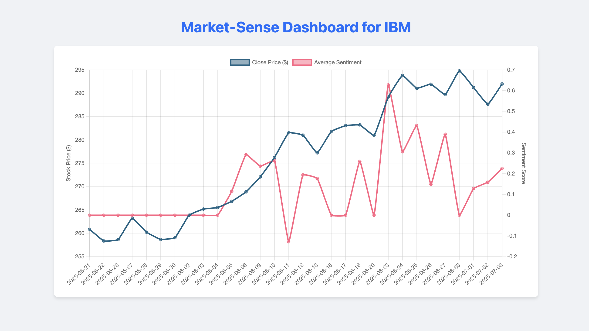

# Market-Sense

**My full-stack web app for visualizing how financial news sentiment impacts stock prices.**



## Why I Built this

After my quantitative trading model was blindsided by a sudden news event, I realized that the numbers on the chart were really half the story. I became obsessed with the idea of seeing the "human" element - the fear & greed reflected in the news—right alongside the hard data. I wanted to build a tool that could bridge that gap.

Market-Sense is my answer. It's a web app that pulls daily stock prices and the latest financial news, analyzes the sentiment of the headlines, and then plots both on a single, interactive graph. This project was my deep dive into full-stack development, APIs, and the challenge of turning messy real-world news into structured/visual data. It's my attempt to create a clearer, more contextual view of the market.

## What It Does

-   **Fetches daily stock prices and relevant news** for a given ticker using the Alpha Vantage API.
-   **Analyzes news headlines** to calculate an average daily sentiment score
-   **Plots both price and sentiment** on an interactive Chart.js graph with two Y-axes for easy comparison
-   **Built on a simple full-stack architecture** with a Python/Flask backend for data processing and a clean HTML/JS frontend for visualization.

## Tech Stack

-   **Backend:** Python, Flask
-   **Frontend:** HTML, CSS, JavaScript, Chart.js
-   **Data Source:** Alpha Vantage API
-   **Libraries:** Requests

## Local Setup and Installation

Follow these steps to run the project on your local machine.

**1. Clone the Repository**
```bash
git clone https://github.com/your-username/market-sense-project.git
cd market-sense-project
```

**2. Create and Activate a Virtual Environment**
```bash
# Create the virtual environment
python -m venv venv

# Activate on macOS/Linux
source venv/bin/activate

# Activate on Windows
.\venv\Scripts\activate
```

**3. Install Dependencies**
This project's dependencies are listed in the `requirements.txt` file.
```bash
pip install -r requirements.txt
```

**4. Add Your API Key**
This project requires a free API key from Alpha Vantage. Note that there's a free limit to the number of data retrievals through Alpha Vantage, which is why the graph may stop appearing after a number of attempts.

> **Important:** Get your free key at [https://www.alphavantage.co/support/#api-key](https://www.alphavantage.co/support/#api-key)

Open the `app.py` file and replace `'YOUR_API_KEY'` with your actual key.

**5. Run the Application**
```bash
python app.py
```
Open your web browser and navigate to `http://122.0.0.1:5000` to see the application running.

feel free to email julian.vignes2@gmail.com to notify about any bugs :)
